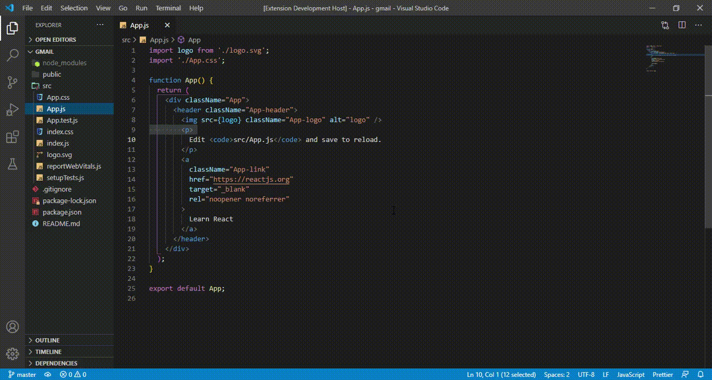
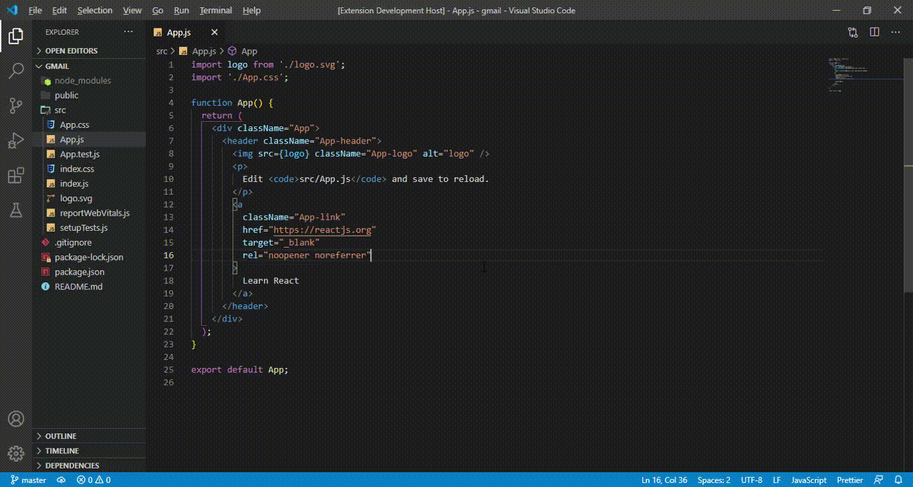

# react-easy-snnipate 
This extention will be create a javascript file and .css fille so esaly and also write a rfce snnipate while createing the .js file.

## Installation
Visual Studio Marketplace

# Command
## rfce
press ctrl + p and then enter rfce command. it will ask a filename please enter the filename.
>Tip1: end of the file .js is a optionl.

>Tip2: If you want to be create a file in src directory, then just type filename.

>Tip3: if you want to create a direactory in that direactory you want to create a file, than just type foldername/filename.

>Tip: If you want to be create a nested directory , than type Foldername/Foldername ... /Filename

# keyboard shortcut is alt+n By default You can change
## examples

**Thank You**
